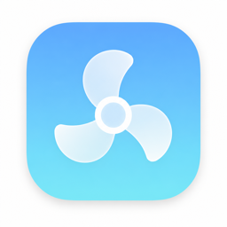

# AirPulse — Mac Fan Control for MacBook Pro

<p align="center">
  
</p>

**AirPulse** is a free, open-source **Mac fan control** app for macOS. Menu-bar temperatures, linked dual-fan control, and **AirPulse Smart mode** that reacts to heat *before* your MacBook turns into a jet engine.

Built for **Apple Silicon** MacBook / MacBook Pro (M-series). Fans on both sides stay linked by default.

> 中文说明见 [README.zh-CN.md](README.zh-CN.md).

## Modes

AirPulse keeps the control model simple — three modes only:

| Mode | What it does |
|------|----------------|
| **AirPulse Smart mode** | Recommended daily driver. Fan speed follows temperature automatically (see map below). |
| **Custom** | You set a fixed linked speed with the slider. |
| **Auto** | Hands control back to macOS / SMC. |

## Why AirPulse Smart mode beats system Auto

macOS **Auto** keeps fans under system control. It works — but it is a black box: fans often stay quiet too long, then spike hard when temperatures are already high. You cannot see the rule, and you cannot tune it.

**AirPulse Smart mode** is transparent: a **temperature → fan speed** policy that *you* own.

| | System **Auto** | **AirPulse Smart mode** |
|--|-----------------|-------------------------|
| Who decides RPM | Apple SMC / thermalmonitord | AirPulse, every ~1s |
| When fans rise | Often late, then aggressive | Earlier, smoother climb |
| Predictable? | No — opaque | Yes — fixed knots you can reason about |
| Noise profile | Sudden ramp-ups under load | Gradual with temperature |
| Safety net | System only | Smart mode **plus** thermal floor & emergency boost |

Default AirPulse Smart mode map (linear between points):

| Temp | Fan (of min→max range) |
|------|-------------------------|
| ≤55°C | ~15% — stay quiet when cool |
| 70°C | ~40% |
| 82°C | ~70% |
| ≥92°C | ~95% — strong cooling |

## Thermal safety

Leaving fans too low under load can pack heat. AirPulse actively prevents that — especially in **Custom**:

| Threshold | Action |
|-----------|--------|
| **≥78°C** | Minimum floor ≈45% (drops only after cooling ~4°C) |
| **≥85°C** | Minimum floor ≈70% (with hysteresis) |
| **≥90°C** | Emergency cool ≈85% (or Smart map, whichever is higher) |
| **≥100°C** | Hand control back to system **Auto** |

Also: restore Auto on quit / helper disconnect, helper API version check, re-assert after sleep/wake, and helper warm-up so the first manual write is less laggy.

## Download

Latest DMG: **[Releases](https://github.com/bhu0345/AirPulse/releases)** (current: **v0.5.2**)

1. Download `AirPulse-x.y.z.dmg`
2. Drag **AirPulse** into **Applications**
3. Launch from Applications (menu-bar fan icon)
4. Tap **Enable Fan Control** once (admin password)
5. Choose **AirPulse Smart mode** for everyday use — or **Custom** / **Auto**

> Unsigned build first open: right-click → **Open**, or allow under **System Settings → Privacy & Security**.

## Features

- Menu-bar popover: CPU / GPU / battery temps + linked master slider
- Three presets: **Auto · Custom · Smart** (AirPulse Smart mode is visually highlighted)
- Optional unlink for independent left/right fans
- Set-and-forget controls (language, **°C / °F**, Launch at Login, Restore Auto) tucked under **Advanced**
- Right-click the menu-bar icon for **Restore Auto** and **Quit**
- Launch at Login + remembers last preset / speed
- English UI by default, in-app **English / 中文**
- Apple Silicon SMC (`F%dmd` / `F%dMd`, optional `Ftst`)
- CLI: `airpulse-cli probe [--write]` / `preset <auto\|custom\|smart>`

## Quick start

```bash
open ./Release/AirPulse.app
# or from source:
chmod +x Scripts/*.sh
./Scripts/build-app.sh
./Scripts/package-dmg.sh   # optional DMG under dist/
```

```bash
sudo ./Scripts/install-helper.sh   # optional; or use in-app Enable Fan Control
```

Do not run another Mac fan control app at the same time — SMC writes will conflict.

## Architecture

```text
AirPulse.app (NSStatusItem + SwiftUI popover)
    ├─ reads: in-process SMCKit
    └─ writes: XPC → AirPulseHelper (LaunchDaemon)
```

Gatekeeper-friendly distribution needs a Developer ID — see [`docs/prerequisites.md`](docs/prerequisites.md) and `Scripts/sign-and-notarize.sh` (ad-hoc builds work locally with right-click Open).

## Caution

Manual fan control can affect cooling, noise, and hardware longevity. AirPulse’s safety layer reduces risk; it does not eliminate it. Prefer **AirPulse Smart mode** or **Auto** under unknown workloads; never ignore rising temperatures.

## Keywords

`mac fan control` · `macbook fan control` · `AirPulse Smart mode` · `macos fan controller` · `apple silicon fan` · `smc fan control` · `menu bar fan app`
